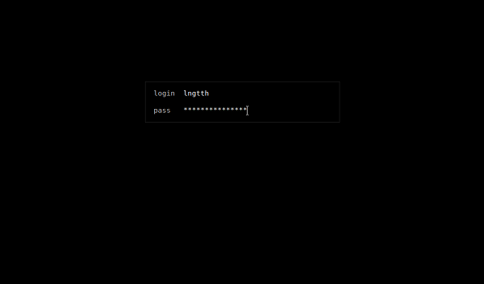
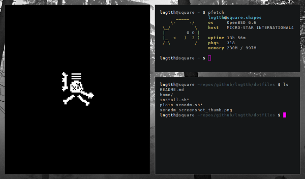

# Dotfiles

My personal configurations

Run `install.sh` as the user to install dotfiles for

## xenodm

Run `plain_xenodm.sh` as root to style xenodm

## bspwm 

Default bspwm, minimal sxhkd, no bar

